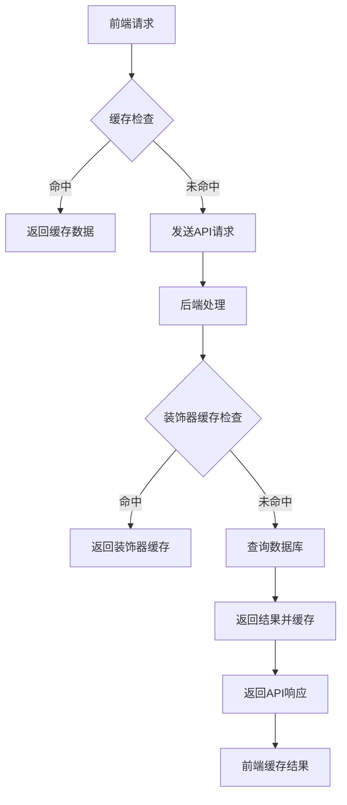
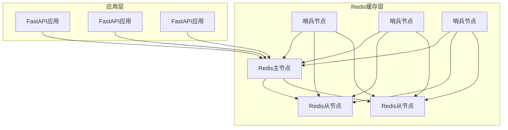
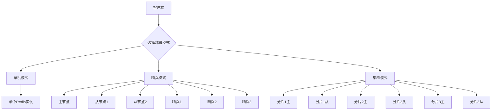
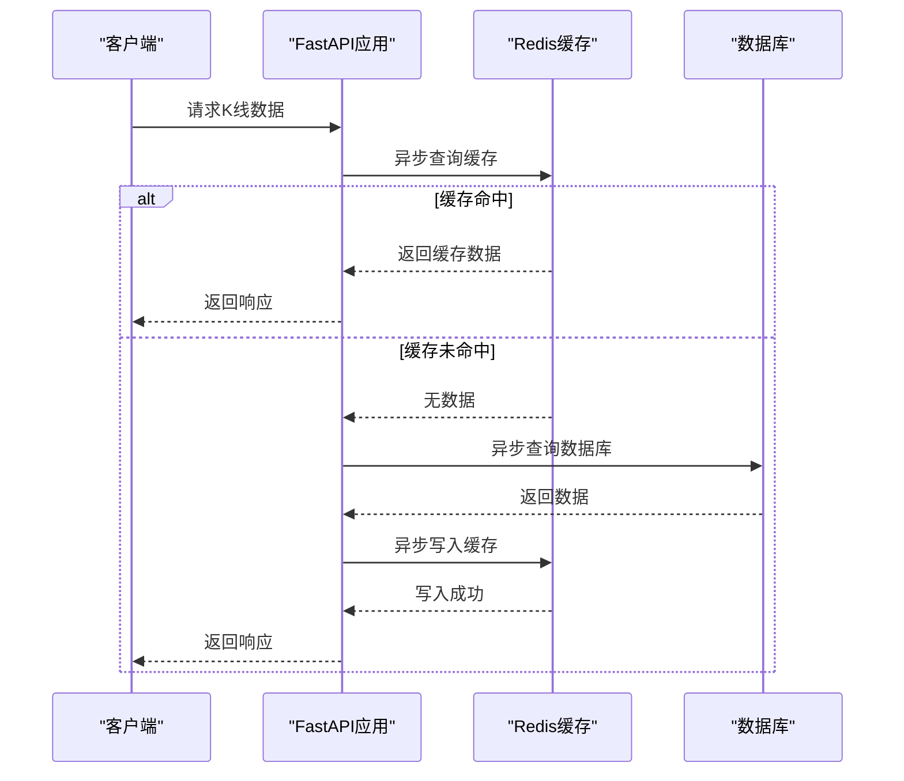

# 缓存技术选型

<cite>
**本文档引用的文件**  
- [performance_recommendations.md](file://performance_recommendations.md)
- [app/main.py](file://app/main.py)
- [app/api/v1/endpoints/kline.py](file://app/api/v1/endpoints/kline.py)
- [app/services/kline_aggregator.py](file://app/services/kline_aggregator.py)
- [app/core/config.py](file://app/core/config.py)
- [chan.py\Common\cache.py](file://chan.py/Common/cache.py)
- [frontend/src/lib/api.js](file://frontend/src/lib/api.js)
- [requirements.txt](file://requirements.txt)
</cite>

## 目录
1. [引言](#引言)
2. [项目缓存需求分析](#项目缓存需求分析)
3. [现有缓存机制评估](#现有缓存机制评估)
4. [Redis作为缓存层的适用性分析](#redis作为缓存层的适用性分析)
5. [Redis与其他缓存方案对比](#redis与其他缓存方案对比)
6. [Redis部署模式建议](#redis部署模式建议)
7. [Redis与FastAPI集成方案](#redis与fastapi集成方案)
8. [实施细节](#实施细节)
9. [结论](#结论)

## 引言
本项目为一个基于缠论的自动化交易系统，集成了K线数据聚合、技术分析、买卖点识别等功能。随着系统规模的扩大和用户请求的增加，数据库查询压力显著上升，特别是对高频K线数据的访问。为提升系统性能和响应速度，需要引入高效的缓存机制。本文档将详细分析并推荐适合本项目的缓存技术方案，重点评估Redis作为缓存层的适用性。

## 项目缓存需求分析
本项目具有以下缓存需求特点：

- **高频K线数据访问**：系统需要频繁查询和聚合K线数据，用于技术分析和图表展示。
- **多时间周期支持**：支持1分钟、5分钟、15分钟、1小时、4小时、1天等多种时间周期的K线数据。
- **实时性要求高**：交易系统对数据实时性要求较高，但允许一定程度的延迟。
- **数据量大**：K线数据量庞大，需要高效的存储和检索机制。
- **支持数据过期**：缓存数据需要设置合理的过期策略，确保数据新鲜度。
- **可扩展性**：系统需要支持未来用户量和数据量的增长。

**Section sources**
- [app/api/v1/endpoints/kline.py](file://app/api/v1/endpoints/kline.py#L0-L194)
- [app/services/kline_aggregator.py](file://app/services/kline_aggregator.py#L0-L250)

## 现有缓存机制评估
目前项目中存在两种缓存机制：

1. **前端本地缓存**：前端使用JavaScript的Map对象实现简单的内存缓存，设置不同的缓存时长（5分钟、30分钟、30秒）。
2. **Python装饰器缓存**：后端使用`make_cache`装饰器实现方法级别的内存缓存，将结果存储在实例的`_memoize_cache`字典中。



**Diagram sources**
- [frontend/src/lib/api.js](file://frontend/src/lib/api.js#L219-L263)
- [chan.py\Common\cache.py](file://chan.py/Common/cache.py#L0-L33)

**Section sources**
- [frontend/src/lib/api.js](file://frontend/src/lib/api.js#L219-L263)
- [chan.py\Common\cache.py](file://chan.py/Common/cache.py#L0-L33)

## Redis作为缓存层的适用性分析
根据`performance_recommendations.md`中的建议，推荐使用Redis作为缓存层，原因如下：

### 1. 高频K线数据处理优势
Redis作为内存数据库，具有极高的读写性能，非常适合处理高频K线数据的访问请求。通过将常用的K线数据缓存到Redis中，可以显著减少数据库查询压力，提高系统响应速度。

### 2. 数据过期策略支持
Redis支持多种数据过期策略，包括TTL（Time To Live）和LRU（Least Recently Used）等。可以根据不同数据的特性设置不同的过期时间，确保缓存数据的新鲜度。

### 3. 持久化能力
Redis提供RDB和AOF两种持久化机制，可以在保证高性能的同时，确保数据的持久性。这对于交易系统中的重要数据缓存尤为重要。

### 4. 集群扩展能力
Redis支持主从复制、哨兵模式和集群模式，可以轻松实现水平扩展，满足系统未来增长的需求。



**Diagram sources**
- [performance_recommendations.md](file://performance_recommendations.md#L0-L107)

**Section sources**
- [performance_recommendations.md](file://performance_recommendations.md#L0-L107)

## Redis与其他缓存方案对比
| 方案 | 优点 | 缺点 | 适用场景 |
| --- | --- | --- | --- |
| **Redis** | 高性能、支持多种数据结构、支持持久化、集群扩展、丰富的功能 | 配置相对复杂、需要额外的运维成本 | 高并发、高可用、需要持久化的场景 |
| **Memcached** | 简单易用、高性能、内存效率高 | 不支持持久化、不支持复杂数据结构、扩展性有限 | 简单的键值缓存、不需要持久化的场景 |
| **本地LRU缓存** | 实现简单、无网络开销、低延迟 | 内存有限、无法共享、重启后数据丢失 | 小规模应用、单实例部署、对一致性要求不高的场景 |

对于本项目而言，Redis在处理高频K线数据、支持数据过期策略、持久化能力和集群扩展方面具有明显优势，是最适合的缓存方案。

**Section sources**
- [performance_recommendations.md](file://performance_recommendations.md#L0-L107)

## Redis部署模式建议
根据项目规模和可用性要求，建议采用以下部署模式：

### 1. 单机模式
适用于开发和测试环境，部署简单，成本低。

### 2. 哨兵模式
适用于生产环境，提供高可用性。建议配置3个哨兵节点和1主2从的Redis实例。

### 3. 集群模式
适用于大规模生产环境，提供高可用性和水平扩展能力。建议至少6个节点（3主3从）。



**Diagram sources**
- [performance_recommendations.md](file://performance_recommendations.md#L0-L107)

**Section sources**
- [performance_recommendations.md](file://performance_recommendations.md#L0-L107)

## Redis与FastAPI集成方案
### 1. 依赖安装
```bash
pip install redis
pip install aioredis
```

### 2. 连接池配置
在`app/core/config.py`中添加Redis配置：
```python
class Settings(BaseSettings):
    # ... 其他配置
    REDIS_HOST: str = os.getenv("REDIS_HOST", "localhost")
    REDIS_PORT: int = int(os.getenv("REDIS_PORT", 6379))
    REDIS_DB: int = int(os.getenv("REDIS_DB", 0))
    REDIS_PASSWORD: Optional[str] = os.getenv("REDIS_PASSWORD")
    REDIS_POOL_SIZE: int = int(os.getenv("REDIS_POOL_SIZE", 10))
```

### 3. 异步支持
使用`aioredis`库实现异步操作，提高并发性能。



**Diagram sources**
- [app/core/config.py](file://app/core/config.py#L0-L65)
- [requirements.txt](file://requirements.txt#L0-L17)

**Section sources**
- [app/core/config.py](file://app/core/config.py#L0-L65)
- [requirements.txt](file://requirements.txt#L0-L17)

## 实施细节
### 1. 依赖安装
```bash
pip install redis aioredis
```

### 2. 连接池配置
```python
import aioredis
from app.core.config import settings

redis_pool = aioredis.ConnectionPool(
    host=settings.REDIS_HOST,
    port=settings.REDIS_PORT,
    db=settings.REDIS_DB,
    password=settings.REDIS_PASSWORD,
    max_connections=settings.REDIS_POOL_SIZE,
    decode_responses=True
)

redis_client = aioredis.Redis(connection_pool=redis_pool)
```

### 3. 异步支持
使用`aioredis`库实现异步操作，与FastAPI的异步特性完美配合。

### 4. 缓存策略
- 热点K线数据：缓存30秒
- 聚合K线数据：缓存5分钟
- 静态数据：缓存30分钟

**Section sources**
- [requirements.txt](file://requirements.txt#L0-L17)
- [performance_recommendations.md](file://performance_recommendations.md#L0-L107)

## 结论
综合考虑本项目的需求特点和现有技术栈，Redis是最适合的缓存解决方案。相比现有的内存缓存机制和Memcached等其他方案，Redis在性能、功能、可靠性和扩展性方面都具有明显优势。建议采用哨兵模式部署Redis，通过`aioredis`库与FastAPI应用集成，实现高效的异步缓存操作。这将显著提升系统的性能和用户体验。