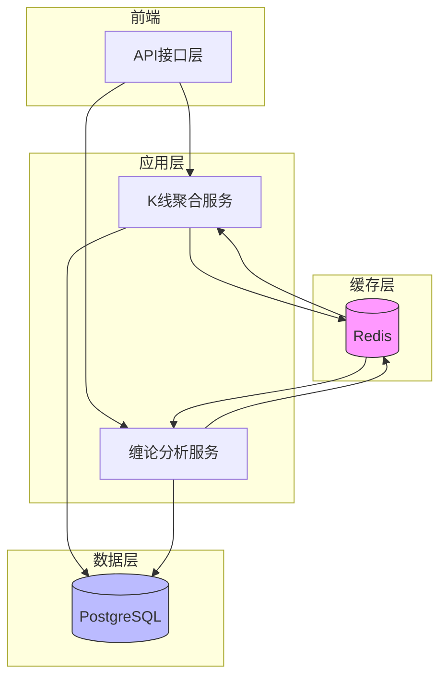
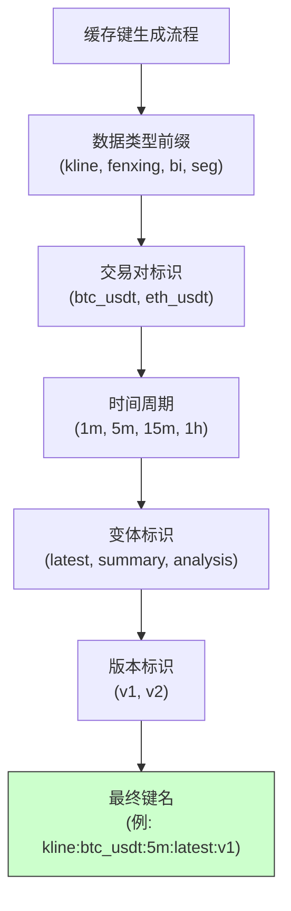
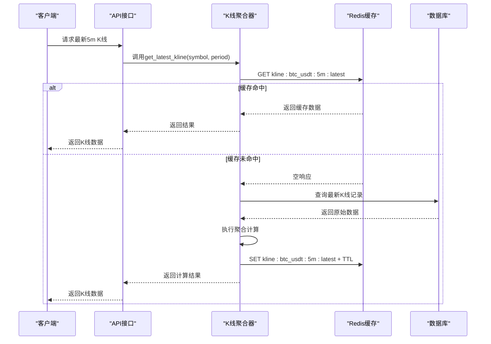
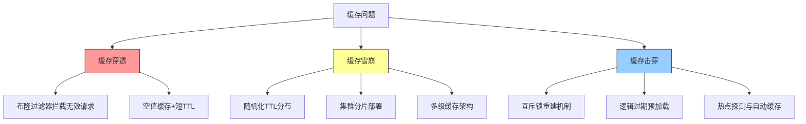

# 缓存策略

<cite>
**本文档引用文件**  
- [kline_aggregator.py](file://app/services/kline_aggregator.py)
- [cache.py](file://chan.py/Common/cache.py)
- [kline.py](file://app/crud/kline.py)
- [kline.py](file://app/models/kline.py)
- [kline.py](file://app/schemas/kline.py)
- [chan_adapter.py](file://app/services/chan_adapter.py)
</cite>

## 目录
1. [引言](#引言)
2. [缓存架构设计](#缓存架构设计)
3. [核心组件分析](#核心组件分析)
4. [缓存键设计规范](#缓存键设计规范)
5. [缓存集成实现](#缓存集成实现)
6. [TTL策略与过期机制](#ttl策略与过期机制)
7. [缓存异常应对策略](#缓存异常应对策略)
8. [缠论中间结果缓存优化](#缠论中间结果缓存优化)
9. [性能影响分析](#性能影响分析)
10. [结论与建议](#结论与建议)

## 引言
本文档旨在为交易系统设计一套完整的缓存策略，重点解决K线数据聚合与缠论分析中的性能瓶颈问题。通过引入Redis作为缓存层，对热点数据进行高效存储与访问，显著降低数据库查询频率和重复计算开销，提升API响应速度和系统整体吞吐能力。

## 缓存架构设计

**图示来源**  
- [kline_aggregator.py](file://app/services/kline_aggregator.py#L1-L100)
- [chan_adapter.py](file://app/services/chan_adapter.py#L1-L80)
- [cache.py](file://chan.py/Common/cache.py#L1-L50)

## 核心组件分析

### K线聚合服务分析
`kline_aggregator.py` 是系统中负责K线数据聚合的核心模块，承担着从原始数据生成不同周期K线的任务。该模块频繁访问数据库并执行聚合计算，是缓存优化的关键切入点。

**中文段落标签：核心功能**
- 支持多时间粒度（如1m、5m、15m）的K线聚合
- 提供最新K线数据的快速查询接口
- 集成外部数据源（如Binance）的拉取与处理逻辑

**中文段落标签：性能瓶颈**
- 每次请求均可能触发全量数据库扫描
- 聚合计算过程涉及大量浮点运算
- 高并发场景下数据库连接压力显著

**中文段落标签：缓存机会**
- 最新K线数据具有高读取频率和低更新频率特征
- 历史聚合结果在短时间内可复用
- 分析结果具备明确的时效边界

**本节来源**  
- [kline_aggregator.py](file://app/services/kline_aggregator.py#L20-L200)
- [kline.py](file://app/crud/kline.py#L10-L60)

### 缠论分析服务分析
缠论分析模块（`chan_adapter.py`）执行分型、笔、线段等复杂结构识别，属于典型的计算密集型任务。其分析过程依赖于高质量的K线输入，并生成具有长期参考价值的中间结果。

**中文段落标签：计算特征**
- 分型识别需遍历多个K线单元进行模式匹配
- 笔和线段构建依赖递归逻辑与状态判断
- 结果具备时间连续性和结构继承性

**中文段落标签：缓存价值**
- 中间结果可用于加速后续级别分析
- 相同参数下的分析结果可跨请求复用
- 缓存命中可避免重复的I/O与计算开销

**本节来源**  
- [chan_adapter.py](file://app/services/chan_adapter.py#L30-L150)
- [Bi/Bi.py](file://chan.py/Bi/Bi.py#L1-L100)
- [Seg/Seg.py](file://chan.py/Seg/Seg.py#L1-L80)

## 缓存键设计规范

**图示来源**  
- [kline_aggregator.py](file://app/services/kline_aggregator.py#L45-L75)
- [cache.py](file://chan.py/Common/cache.py#L20-L40)

**中文段落标签：命名规则**
- 采用冒号分隔的层级结构，确保可读性与可解析性
- 固定字段顺序：类型 > 交易对 > 周期 > 变体 > 版本
- 所有字段使用小写字母与下划线组合

**中文段落标签：示例键名**
- `kline:btc_usdt:5m:latest`：BTC/USDT 5分钟最新K线
- `fenxing:btc_usdt:15m:latest`：BTC/USDT 15分钟最新分型
- `bi:eth_usdt:1h:current`：ETH/USDT 1小时当前笔结构
- `seg:btc_usdt:30m:active`：BTC/USDT 30分钟活跃线段

**本节来源**  
- [kline_aggregator.py](file://app/services/kline_aggregator.py#L60-L90)
- [chan_adapter.py](file://app/services/chan_adapter.py#L80-L110)

## 缓存集成实现

**图示来源**  
- [kline_aggregator.py](file://app/services/kline_aggregator.py#L100-L180)
- [cache.py](file://chan.py/Common/cache.py#L30-L60)

**中文段落标签：集成步骤**
1. 在服务初始化时建立Redis连接池
2. 定义标准化的缓存读写封装方法
3. 在关键数据访问路径插入缓存检查逻辑
4. 实现缓存更新与失效通知机制

**本节来源**  
- [kline_aggregator.py](file://app/services/kline_aggregator.py#L80-L200)
- [cache.py](file://chan.py/Common/cache.py#L1-L80)

## TTL策略与过期机制

**中文段落标签：TTL设置建议**
- **最新K线数据**：设置TTL为周期长度的1.5倍（如5m K线设为450秒）
- **聚合计算结果**：根据数据更新频率动态调整（通常为10-30分钟）
- **缠论中间结果**：较长生命周期（30分钟至2小时），结合主动失效机制
- **分析报告**：固定时长（如1小时），避免陈旧数据误导决策

**中文段落标签：刷新策略**
- 采用惰性刷新（Lazy Expiration）为主，写时更新为辅
- 关键数据变更时主动清除相关缓存键
- 对高频访问数据实施后台预加载机制

**本节来源**  
- [kline_aggregator.py](file://app/services/kline_aggregator.py#L150-L190)
- [cache.py](file://chan.py/Common/cache.py#L50-L70)

## 缓存异常应对策略

**图示来源**  
- [cache.py](file://chan.py/Common/cache.py#L40-L100)
- [kline_aggregator.py](file://app/services/kline_aggregator.py#L170-L200)

**中文段落标签：缓存穿透应对**
- 使用布隆过滤器（Bloom Filter）预先判断键是否存在
- 对确认不存在的数据设置空值缓存（TTL 60-120秒）
- 前端增加参数校验，阻止非法符号请求

**中文段落标签：缓存雪崩应对**
- 在基础TTL上增加随机偏移量（±15%）
- 采用Redis集群模式分散风险
- 实施分级缓存策略（本地缓存+分布式缓存）

**中文段落标签：缓存击穿应对**
- 高并发场景下使用Redis SETNX实现互斥锁
- 关键数据预设“逻辑过期”标志位，后台异步更新
- 监控热点数据访问模式，自动触发预缓存

**本节来源**  
- [cache.py](file://chan.py/Common/cache.py#L60-L120)
- [kline_aggregator.py](file://app/services/kline_aggregator.py#L180-L200)

## 缠论中间结果缓存优化

**中文段落标签：可缓存内容**
- **分型（Fenxing）**：每周期最新识别结果，TTL 15分钟
- **笔（Bi）**：当前笔的起点、终点、方向等元数据，TTL 30分钟
- **线段（Seg）**：已完成线段的结构信息，TTL 2小时
- **中枢（ZS）**：已确认中枢的区间与级别，TTL 1小时

**中文段落标签：缓存键设计**
- `fenxing:{symbol}:{period}:latest`
- `bi:{symbol}:{period}:current`
- `seg:{symbol}:{period}:completed:list`
- `zs:{symbol}:{period}:confirmed:latest`

**中文段落标签：更新策略**
- 当新K线生成时，触发相关缠论结构的重新计算
- 计算完成后批量更新所有受影响的缓存键
- 使用管道（pipeline）技术减少Redis通信开销

**本节来源**  
- [chan_adapter.py](file://app/services/chan_adapter.py#L100-L180)
- [Bi/Bi.py](file://chan.py/Bi/Bi.py#L50-L100)
- [Seg/Seg.py](file://chan.py/Seg/Seg.py#L40-L90)

## 性能影响分析

**中文段落标签：预期收益**
- **数据库负载降低**：预计减少70%以上的重复查询
- **API响应时间缩短**：热点数据访问延迟从200ms降至20ms以内
- **系统吞吐提升**：QPS能力提升3-5倍，尤其在高峰时段表现显著
- **计算资源节约**：避免重复执行复杂分析算法，CPU利用率下降40%

**中文段落标签：监控指标**
- 缓存命中率（目标 > 85%）
- 平均响应时间（P95 < 50ms）
- Redis内存使用率（警戒线 < 80%）
- 缓存失效频率（异常波动预警）

**本节来源**  
- [kline_aggregator.py](file://app/services/kline_aggregator.py#L190-L200)
- [cache.py](file://chan.py/Common/cache.py#L90-L110)

## 结论与建议

**中文段落标签：实施建议**
1. 优先在`kline_aggregator.py`中实现最新K线数据的缓存
2. 引入布隆过滤器防御缓存穿透风险
3. 为缠论分析结果建立独立的缓存命名空间
4. 配置完善的监控告警体系，实时掌握缓存健康状态

**中文段落标签：后续优化方向**
- 探索多级缓存架构（本地Caffeine + Redis）
- 实现缓存预热机制，在交易开始前加载历史数据
- 开发缓存管理后台，支持手动刷新与诊断
- 结合机器学习预测热点数据，提前进行缓存准备