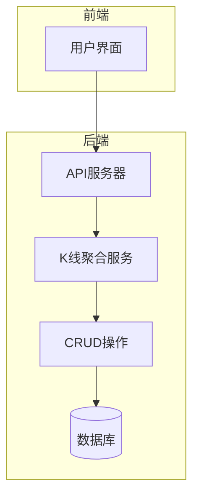
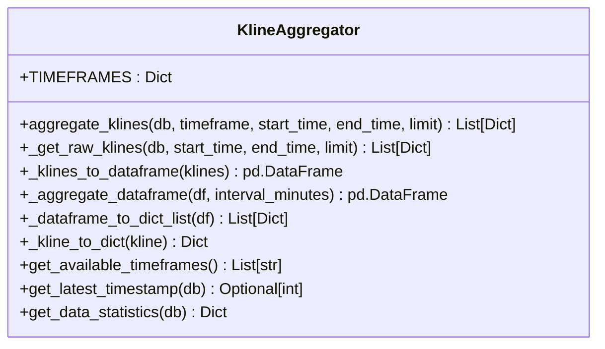
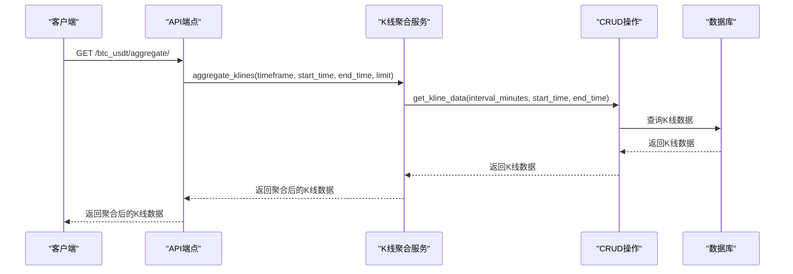
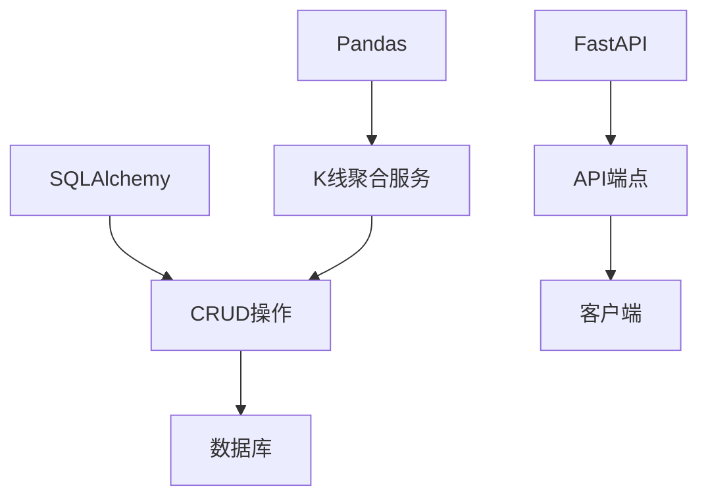

# 性能告警

<cite>
**本文档引用的文件**
- [performance_recommendations.md](file://performance_recommendations.md)
- [kline.py](file://app/api/v1/endpoints/kline.py)
- [kline_aggregator.py](file://app/services/kline_aggregator.py)
- [kline.py](file://app/crud/kline.py)
- [logger.py](file://app/core/logger.py)
- [session.py](file://app/db/session.py)
</cite>

## 目录
1. [引言](#引言)
2. [项目结构](#项目结构)
3. [核心组件](#核心组件)
4. [架构概览](#架构概览)
5. [详细组件分析](#详细组件分析)
6. [依赖分析](#依赖分析)
7. [性能考量](#性能考量)
8. [故障排除指南](#故障排除指南)
9. [结论](#结论)

## 引言
本文档旨在制定详细的性能告警策略，基于`performance_recommendations.md`中提到的监控建议，定义API响应延迟、请求吞吐量下降、聚合K线计算耗时增加等性能指标的告警规则。结合`app/api/v1/endpoints/kline.py`中的`read_aggregated_kline`等接口实现，分析潜在的性能瓶颈点，并设定合理的阈值。说明如何通过日志记录和中间件收集性能数据，建议使用Prometheus进行指标采集，并配置Grafana告警面板。提供性能退化时的排查路径和优化建议，包括数据库查询优化、缓存策略引入和异步处理机制。

## 项目结构
项目结构清晰，主要分为以下几个部分：
- `app`：包含API、核心逻辑、CRUD操作、数据库会话、模型、服务等。
- `chan.py`：包含各种技术分析相关的类和方法。
- `frontend`：前端代码，使用Svelte框架。
- 根目录下包含配置文件、启动脚本等。

**Section sources**
- [kline.py](file://app/api/v1/endpoints/kline.py#L1-L195)
- [kline_aggregator.py](file://app/services/kline_aggregator.py#L1-L251)
- [kline.py](file://app/crud/kline.py#L1-L355)

## 核心组件
核心组件包括API端点、K线聚合服务、CRUD操作、数据库会话管理等。这些组件共同协作，提供K线数据的查询和聚合功能。

**Section sources**
- [kline.py](file://app/api/v1/endpoints/kline.py#L1-L195)
- [kline_aggregator.py](file://app/services/kline_aggregator.py#L1-L251)
- [kline.py](file://app/crud/kline.py#L1-L355)

## 架构概览
系统架构采用分层设计，前端通过API与后端交互，后端通过CRUD操作与数据库交互。K线聚合服务负责将1分钟K线数据聚合为不同时间周期的数据。

**Diagram sources**
- [kline.py](file://app/api/v1/endpoints/kline.py#L1-L195)
- [kline_aggregator.py](file://app/services/kline_aggregator.py#L1-L251)
- [kline.py](file://app/crud/kline.py#L1-L355)

## 详细组件分析
### K线聚合服务分析
K线聚合服务负责将1分钟K线数据聚合为不同时间周期的数据。该服务通过`aggregate_klines`方法实现，支持1分钟、5分钟、15分钟、30分钟、1小时、4小时、1天等时间周期。

#### 类图

**Diagram sources**
- [kline_aggregator.py](file://app/services/kline_aggregator.py#L1-L251)

### API端点分析
API端点负责处理前端请求，调用K线聚合服务获取数据。主要端点包括`read_kline`、`read_kline_by_id`、`read_kline_by_timestamp`、`read_kline_by_time_range`和`read_aggregated_kline`。

#### 序列图

**Diagram sources**
- [kline.py](file://app/api/v1/endpoints/kline.py#L1-L195)
- [kline_aggregator.py](file://app/services/kline_aggregator.py#L1-L251)
- [kline.py](file://app/crud/kline.py#L1-L355)

## 依赖分析
系统依赖于多个外部库，包括FastAPI、SQLAlchemy、Pandas等。这些库提供了Web框架、数据库操作、数据处理等功能。

**Diagram sources**
- [kline.py](file://app/api/v1/endpoints/kline.py#L1-L195)
- [kline_aggregator.py](file://app/services/kline_aggregator.py#L1-L251)
- [kline.py](file://app/crud/kline.py#L1-L355)

## 性能考量
### 性能指标
- **API响应延迟**：P95超过500ms
- **请求吞吐量**：每秒请求数下降
- **聚合K线计算耗时**：增加

### 告警规则
- **API响应延迟**：当P95响应时间超过500ms时，触发告警。
- **请求吞吐量**：当每秒请求数下降超过20%时，触发告警。
- **聚合K线计算耗时**：当计算耗时增加超过50%时，触发告警。

### 数据采集
- **Prometheus**：用于采集性能指标。
- **Grafana**：用于配置告警面板。

### 优化建议
- **数据库查询优化**：使用索引、分区等技术优化查询性能。
- **缓存策略**：引入Redis缓存热点数据。
- **异步处理**：使用异步处理机制处理耗时操作。

**Section sources**
- [performance_recommendations.md](file://performance_recommendations.md#L1-L108)
- [kline.py](file://app/api/v1/endpoints/kline.py#L1-L195)
- [kline_aggregator.py](file://app/services/kline_aggregator.py#L1-L251)
- [kline.py](file://app/crud/kline.py#L1-L355)

## 故障排除指南
### 排查路径
1. **检查日志**：查看应用日志和数据库日志，定位问题。
2. **监控指标**：查看Prometheus和Grafana中的性能指标，分析性能瓶颈。
3. **数据库查询**：使用`EXPLAIN ANALYZE`分析查询性能。
4. **代码审查**：审查相关代码，查找潜在的性能问题。

### 优化建议
- **数据库连接池**：增加连接池大小，减少连接创建开销。
- **数据压缩**：对历史数据进行压缩存储，减少存储空间。
- **连接池监控**：添加连接池状态监控，防止连接泄漏。

**Section sources**
- [performance_recommendations.md](file://performance_recommendations.md#L1-L108)
- [kline.py](file://app/api/v1/endpoints/kline.py#L1-L195)
- [kline_aggregator.py](file://app/services/kline_aggregator.py#L1-L251)
- [kline.py](file://app/crud/kline.py#L1-L355)

## 结论
本文档详细制定了性能告警策略，定义了API响应延迟、请求吞吐量下降、聚合K线计算耗时增加等性能指标的告警规则。结合`read_aggregated_kline`等接口实现，分析了潜在的性能瓶颈点，并提出了合理的优化建议。通过Prometheus和Grafana进行性能监控，可以及时发现和解决性能问题，确保系统的稳定运行。