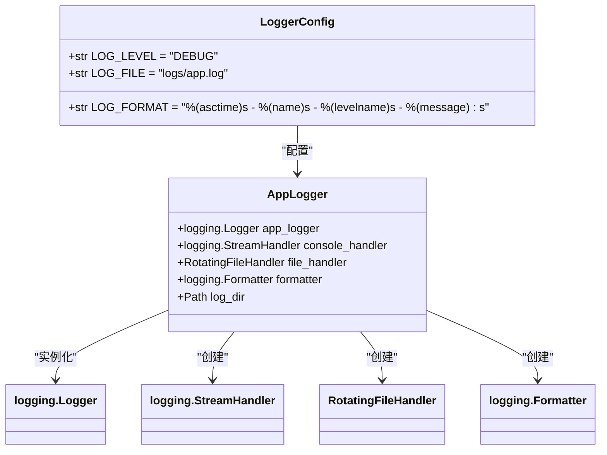
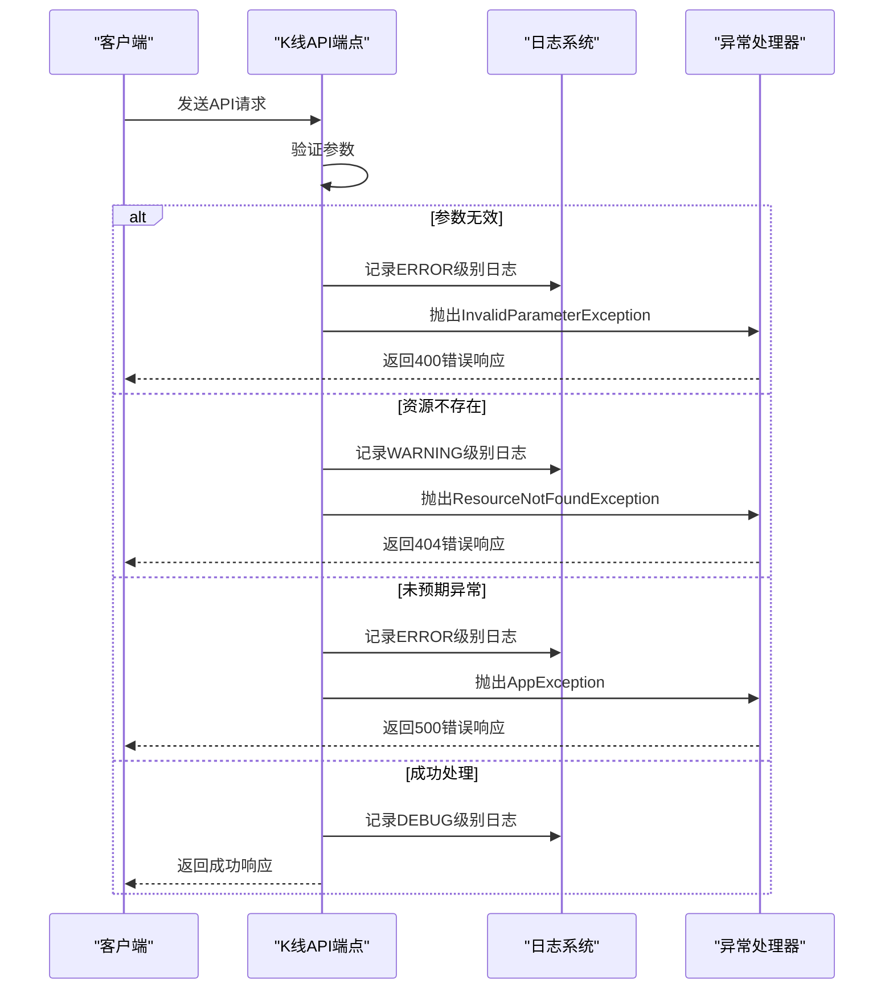
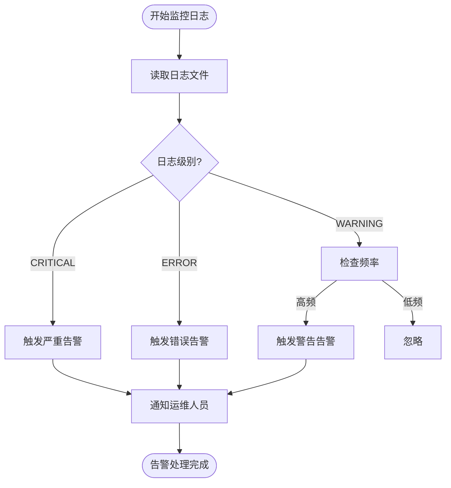
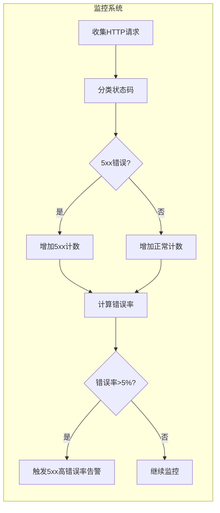
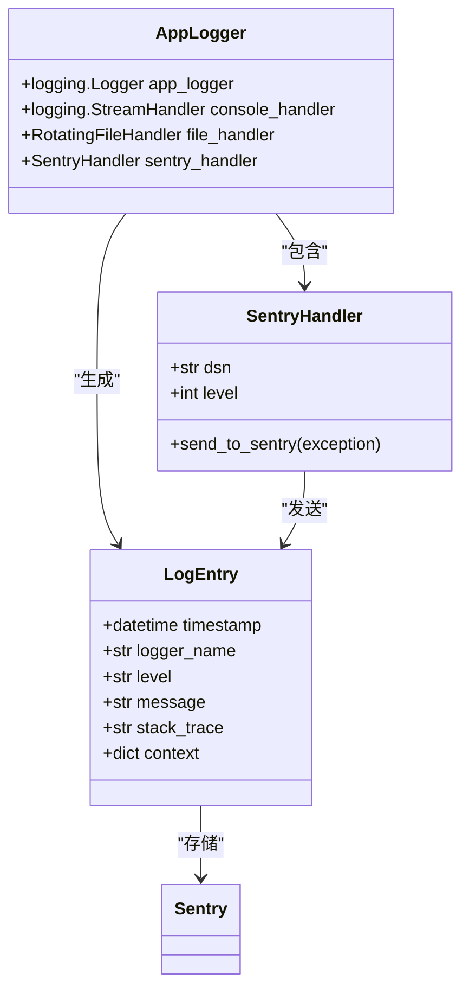
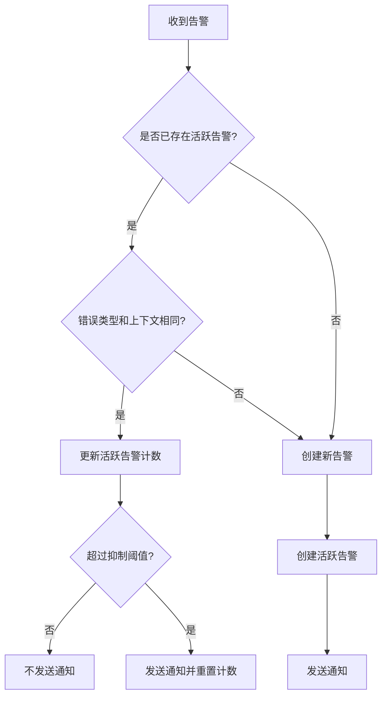
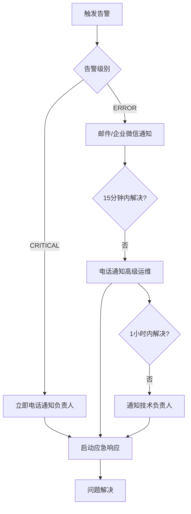

# 错误告警

<cite>
**Referenced Files in This Document**   
- [logger.py](file://app/core/logger.py)
- [kline.py](file://app/api/v1/endpoints/kline.py)
- [exceptions.py](file://app/core/exceptions.py)
- [config.py](file://app/core/config.py)
</cite>

## 目录
1. [日志级别配置](#日志级别配置)
2. [错误处理逻辑](#错误处理逻辑)
3. [告警触发机制](#告警触发机制)
4. [HTTP 5xx错误率监控](#http-5xx错误率监控)
5. [结构化日志与错误追踪](#结构化日志与错误追踪)
6. [告警去重与抑制策略](#告警去重与抑制策略)
7. [通知升级机制](#通知升级机制)

## 日志级别配置

系统通过 `app/core/logger.py` 文件配置了统一的日志记录机制，日志级别由 `app/core/config.py` 中的 `LOG_LEVEL` 配置项控制，默认设置为 "DEBUG" 级别。日志系统创建了名为 "app" 的主日志记录器 `app_logger`，并配置了控制台和文件两种处理器，确保日志信息能够同时输出到标准输出和日志文件中。

日志格式由 `LOG_FORMAT` 配置项定义，采用标准格式 `%(asctime)s - %(name)s - %(levelname)s - %(message)s`，包含时间戳、日志记录器名称、日志级别和消息内容。日志文件存储在 `logs/app.log` 路径下，采用轮转文件处理器，单个文件最大50MB，最多保留10个备份文件。

**Diagram sources**
- [config.py](file://app/core/config.py#L57-L59)
- [logger.py](file://app/core/logger.py#L1-L44)

**Section sources**
- [config.py](file://app/core/config.py#L57-L59)
- [logger.py](file://app/core/logger.py#L1-L44)

## 错误处理逻辑

系统在 `app/api/v1/endpoints/kline.py` 中实现了全面的错误处理机制，通过捕获不同类型的异常并记录相应的日志级别来区分错误的严重程度。对于业务逻辑错误，系统使用自定义的异常类，如 `InvalidParameterException` 和 `ResourceNotFoundException`，这些异常在 `app/core/exceptions.py` 中定义。

当请求参数无效时，系统会抛出 `InvalidParameterException` 异常，并记录 ERROR 级别日志；当请求的资源不存在时，系统会抛出 `ResourceNotFoundException` 异常，并记录 WARNING 级别日志。对于未预期的异常，系统会捕获并记录 ERROR 级别日志，同时返回500内部服务器错误。

**Diagram sources**
- [kline.py](file://app/api/v1/endpoints/kline.py#L30-L194)
- [exceptions.py](file://app/core/exceptions.py#L35-L43)

**Section sources**
- [kline.py](file://app/api/v1/endpoints/kline.py#L30-L194)
- [exceptions.py](file://app/core/exceptions.py#L35-L43)

## 告警触发机制

基于日志级别的告警触发机制主要依赖于 `app_logger` 记录的不同级别日志。系统定义了以下告警触发条件：

- **CRITICAL级别告警**：当系统遇到严重错误，可能导致服务完全不可用时触发。目前代码中未直接使用CRITICAL级别，但可通过监控系统配置，当连续出现多个ERROR级别日志时升级为CRITICAL告警。
- **ERROR级别告警**：当发生可恢复的严重错误时触发，如数据库连接失败、外部服务调用失败等。在 `kline.py` 中，当捕获到未预期的异常时，会记录ERROR级别日志，这将触发告警。
- **WARNING级别告警**：当发生非致命但需要关注的事件时触发，如资源不存在。在 `kline.py` 中，当请求的K线数据不存在时，会记录WARNING级别日志。

告警系统应监控日志文件中的ERROR和CRITICAL级别日志条目，一旦发现即刻触发告警。对于ERROR级别日志，特别是包含 `exc_info=True` 参数的错误日志，应视为高优先级告警，因为这表示发生了异常并记录了完整的堆栈跟踪。

**Diagram sources**
- [logger.py](file://app/core/logger.py#L1-L44)
- [kline.py](file://app/api/v1/endpoints/kline.py#L30-L194)

**Section sources**
- [logger.py](file://app/core/logger.py#L1-L44)
- [kline.py](file://app/api/v1/endpoints/kline.py#L30-L194)

## HTTP 5xx错误率监控

系统通过监控HTTP 5xx错误率来评估服务的健康状况。当5xx错误率超过5%的阈值时，应触发告警。5xx错误主要来源于 `kline.py` 中的异常处理逻辑，特别是当捕获到未预期的异常时抛出的500内部服务器错误。

监控系统应实时统计一段时间窗口内的HTTP请求总数和5xx错误数，计算错误率。对于 `InvalidParameterException`、`ResourceNotFoundException` 等自定义异常，虽然它们通常返回4xx状态码，但也应被监控和分析，因为频繁的参数错误可能表明客户端存在问题或遭受恶意攻击。

**Diagram sources**
- [kline.py](file://app/api/v1/endpoints/kline.py#L150-L194)
- [exceptions.py](file://app/core/exceptions.py#L1-L110)

**Section sources**
- [kline.py](file://app/api/v1/endpoints/kline.py#L150-L194)
- [exceptions.py](file://app/core/exceptions.py#L1-L110)

## 结构化日志与错误追踪

系统通过 `app_logger` 实现了结构化日志记录，每个日志条目都包含时间戳、日志记录器名称、日志级别和消息内容，便于后续的分析和追踪。在错误处理过程中，系统通过设置 `exc_info=True` 参数，确保异常的完整堆栈跟踪被记录到日志中，为错误诊断提供了关键信息。

为了集成Sentry或类似错误追踪系统，可以在 `app/core/logger.py` 中添加Sentry处理器。当记录ERROR或CRITICAL级别日志时，Sentry处理器会自动捕获异常信息并发送到Sentry服务器，实现错误的集中管理和追踪。

**Diagram sources**
- [logger.py](file://app/core/logger.py#L1-L44)
- [kline.py](file://app/api/v1/endpoints/kline.py#L150-L194)

**Section sources**
- [logger.py](file://app/core/logger.py#L1-L44)
- [kline.py](file://app/api/v1/endpoints/kline.py#L150-L194)

## 告警去重与抑制策略

为了防止告警风暴，系统需要实施告警去重和抑制策略。告警去重基于错误类型和上下文信息，对于相同类型的错误在短时间内重复发生，只发送一次告警。告警抑制策略则根据错误的严重程度和系统状态动态调整。

例如，当数据库连接失败导致大量500错误时，系统应识别这是由单一根本原因引起的连锁反应，而不是独立的多个错误。在这种情况下，应抑制重复的500错误告警，只保留最初的数据库连接错误告警，并在告警信息中说明其影响范围。

**Diagram sources**
- [logger.py](file://app/core/logger.py#L1-L44)
- [kline.py](file://app/api/v1/endpoints/kline.py#L30-L194)

**Section sources**
- [logger.py](file://app/core/logger.py#L1-L44)
- [kline.py](file://app/api/v1/endpoints/kline.py#L30-L194)

## 通知升级机制

通知升级机制确保关键错误能够及时通知到运维人员。系统采用多级通知策略，根据错误的严重程度和持续时间逐步升级通知级别。

对于首次出现的ERROR级别错误，通过邮件和企业微信通知初级运维人员；如果错误在15分钟内未解决或持续发生，升级为电话通知高级运维人员；如果错误在1小时内未解决，通知技术负责人。对于CRITICAL级别错误，直接启动最高级别通知，确保相关人员立即响应。

**Diagram sources**
- [logger.py](file://app/core/logger.py#L1-L44)
- [kline.py](file://app/api/v1/endpoints/kline.py#L30-L194)

**Section sources**
- [logger.py](file://app/core/logger.py#L1-L44)
- [kline.py](file://app/api/v1/endpoints/kline.py#L30-L194)