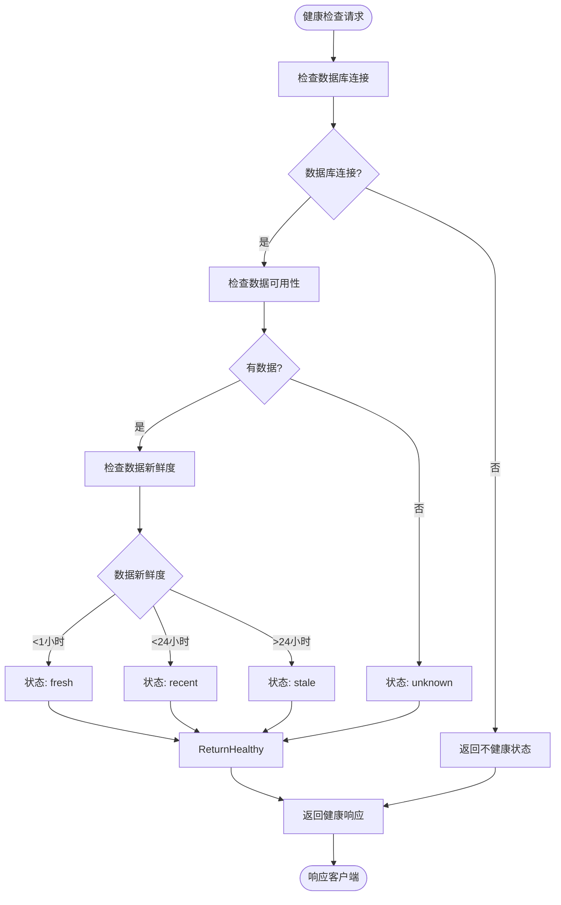
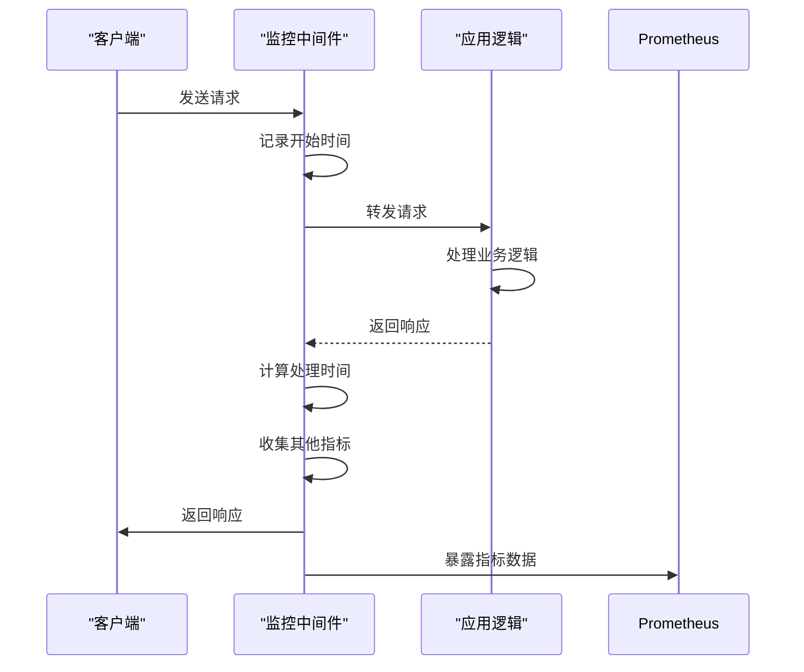

# 指标监控

<cite>
**本文档引用的文件**  
- [performance_recommendations.md](file://performance_recommendations.md)
- [app/main.py](file://app/main.py)
- [app/api/v1/endpoints/kline_simple.py](file://app/api/v1/endpoints/kline_simple.py)
</cite>

## 目录
1. [引言](#引言)
2. [监控系统设计概述](#监控系统设计概述)
3. [健康检查端点实现](#健康检查端点实现)
4. [Prometheus监控集成](#prometheus监控集成)
5. [性能监控中间件设计](#性能监控中间件设计)
6. [关键性能指标定义](#关键性能指标定义)
7. [监控中间件注册流程](#监控中间件注册流程)
8. [性能测试建议](#性能测试建议)

## 引言
本文档旨在建立全面的指标监控体系，重点实现Prometheus监控集成。基于`performance_recommendations.md`中的建议，详细说明如何添加性能监控中间件来收集API响应时间、数据库查询耗时、内存使用率等关键性能指标。文档将结合系统现有架构，解释健康检查端点的设计原理和实现方法，并提供具体的指标定义示例和性能测试建议。

## 监控系统设计概述
根据`performance_recommendations.md`文件中的建议，系统需要实现完整的监控和指标收集体系。该体系主要包括三个核心组件：健康检查端点、性能监控中间件和Prometheus指标暴露接口。这些组件共同构成了系统的可观测性基础，使运维团队能够实时了解系统状态、性能表现和潜在问题。

监控系统的设计遵循以下原则：
- **实时性**：关键指标能够实时反映系统状态
- **可扩展性**：监控框架易于扩展新的指标类型
- **低侵入性**：监控代码对业务逻辑影响最小化
- **标准化**：采用Prometheus标准指标格式

**Section sources**
- [performance_recommendations.md](file://performance_recommendations.md#L48-L51)

## 健康检查端点实现
系统已实现健康检查端点`/health`，用于监控系统整体运行状态。该端点的设计原理是提供一个轻量级的HTTP接口，返回系统关键组件的健康状态，便于监控系统定期探测。

在`app/main.py`中，`/health`端点返回包含以下信息的JSON响应：
- 系统整体状态（"healthy"）
- 详细信息消息
- 各组件状态，包括API、数据库和Chan模块的连接状态

此外，在`kline_simple.py`中还实现了更详细的健康检查功能，能够检查数据库连接状态、K线聚合器就绪状态以及数据的新鲜度。数据新鲜度根据最新数据的时间戳分为"fresh"（1小时内）、"recent"（24小时内）、"stale"（超过24小时）和"unknown"（无数据）四种状态，并提供相应的处理建议。



**Diagram sources**
- [app/main.py](file://app/main.py#L100-L108)
- [app/api/v1/endpoints/kline_simple.py](file://app/api/v1/endpoints/kline_simple.py#L237-L259)

**Section sources**
- [app/main.py](file://app/main.py#L100-L108)
- [app/api/v1/endpoints/kline_simple.py](file://app/api/v1/endpoints/kline_simple.py#L237-L259)

## Prometheus监控集成
根据`performance_recommendations.md`中的建议，系统应添加Prometheus指标收集功能。Prometheus是一种开源的系统监控和警报工具包，特别适合监控微服务架构。

Prometheus通过HTTP协议定期抓取（scrape）目标系统的指标数据。系统需要暴露一个特定的端点（通常是`/metrics`），以Prometheus支持的格式返回指标数据。这些指标可以是计数器（Counter）、仪表（Gauge）、直方图（Histogram）或摘要（Summary）等类型。

集成Prometheus的主要步骤包括：
1. 安装Prometheus客户端库
2. 定义需要收集的指标
3. 在应用中注册指标收集器
4. 暴露指标端点供Prometheus抓取

虽然当前代码中尚未实现Prometheus集成，但这是一个关键的优化建议，应优先实施。

**Section sources**
- [performance_recommendations.md](file://performance_recommendations.md#L48-L51)

## 性能监控中间件设计
性能监控中间件是收集系统性能指标的核心组件。中间件在请求处理流程中插入监控逻辑，能够无侵入地收集各种性能数据。

典型的性能监控中间件应该能够收集以下指标：
- **API响应时间**：记录每个请求的处理时间
- **请求计数**：统计不同端点的请求量
- **数据库查询耗时**：监控数据库操作的性能
- **错误率**：统计各类错误的发生频率
- **内存使用率**：监控应用的内存消耗情况

中间件的工作流程如下：
1. 在请求进入时记录开始时间
2. 执行正常的请求处理流程
3. 在请求完成时计算处理时间并记录其他指标
4. 将指标数据发送到监控系统

这种设计模式确保了监控逻辑与业务逻辑的分离，提高了代码的可维护性。



**Diagram sources**
- [performance_recommendations.md](file://performance_recommendations.md#L48-L51)

**Section sources**
- [performance_recommendations.md](file://performance_recommendations.md#L48-L51)

## 关键性能指标定义
根据系统特点和监控需求，应定义以下关键性能指标：

### 请求计数器
用于统计不同类型请求的数量，帮助分析系统负载和用户行为模式。

```python
# 示例：请求计数器
REQUEST_COUNT = Counter(
    'http_requests_total',
    'Total HTTP requests',
    ['method', 'endpoint', 'status']
)
```

### 响应延迟直方图
用于记录API响应时间的分布情况，帮助识别性能瓶颈。

```python
# 示例：响应延迟直方图
RESPONSE_TIME_HISTOGRAM = Histogram(
    'http_response_time_seconds',
    'HTTP response time in seconds',
    ['method', 'endpoint'],
    buckets=[0.1, 0.3, 0.5, 0.8, 1.0, 2.0, 5.0]
)
```

### 数据库查询指标
监控数据库操作的性能，包括查询次数和耗时。

```python
# 示例：数据库查询指标
DB_QUERY_COUNT = Counter(
    'db_queries_total',
    'Total database queries',
    ['operation', 'table']
)

DB_QUERY_DURATION = Histogram(
    'db_query_duration_seconds',
    'Database query duration in seconds',
    ['operation', 'table']
)
```

### 系统资源指标
监控应用的系统资源使用情况。

```python
# 示例：内存使用率
MEMORY_USAGE = Gauge(
    'memory_usage_bytes',
    'Current memory usage in bytes'
)

# 示例：CPU使用率
CPU_USAGE = Gauge(
    'cpu_usage_percent',
    'Current CPU usage percentage'
)
```

这些指标定义遵循Prometheus的最佳实践，使用清晰的命名约定和适当的标签来提供丰富的上下文信息。

**Section sources**
- [performance_recommendations.md](file://performance_recommendations.md#L48-L51)

## 监控中间件注册流程
在FastAPI应用中，监控中间件的注册流程需要在应用初始化时完成。根据`app/main.py`中的应用初始化逻辑，可以通过以下步骤注册监控中间件：

1. 在应用启动时导入监控中间件模块
2. 使用`app.add_middleware()`方法注册中间件
3. 确保中间件在其他中间件之前注册，以获得准确的性能数据

虽然当前`app/main.py`中尚未实现监控中间件的注册，但其结构为添加此类功能提供了良好的基础。应用在初始化时已经注册了CORS中间件和异常处理器，遵循相同的模式可以轻松添加监控中间件。

注册流程的关键考虑因素包括：
- 中间件的执行顺序
- 异常处理的兼容性
- 性能开销的最小化
- 指标的准确性和完整性

**Section sources**
- [app/main.py](file://app/main.py#L50-L60)

## 性能测试建议
为了验证监控系统的有效性和系统的整体性能，建议进行系统的性能测试。根据`performance_recommendations.md`中的建议，可以使用Locust进行负载测试。

### Locust负载测试
Locust是一个易于使用的负载测试工具，支持用Python编写测试场景。

```bash
# 安装Locust
pip install locust

# 创建locustfile.py
from locust import HttpUser, task, between

class KlineUser(HttpUser):
    wait_time = between(1, 3)
    
    @task
    def get_klines(self):
        self.client.get("/api/v1/simple/klines?timeframe=1h&limit=100")
    
    @task
    def get_health(self):
        self.client.get("/health")
```

运行测试：
```bash
locust -f locustfile.py --host=http://localhost:8000
```

### 测试场景设计
建议的测试场景包括：
1. **基准测试**：测量系统在正常负载下的性能指标
2. **压力测试**：逐步增加负载直到系统达到性能瓶颈
3. **稳定性测试**：长时间运行测试以检查内存泄漏等问题
4. **恢复测试**：测试系统在高负载后的恢复能力

通过这些测试，不仅可以验证系统的性能，还可以验证监控系统能否准确地收集和报告性能数据。

**Section sources**
- [performance_recommendations.md](file://performance_recommendations.md#L79-L82)