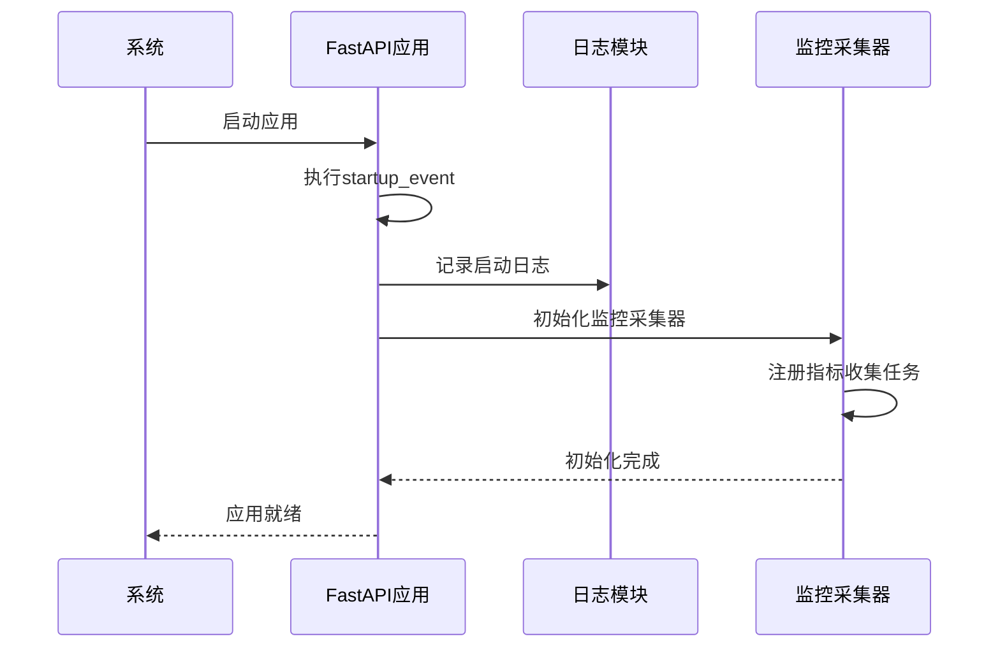

# 系统资源监控

<cite>
**本文档引用文件**  
- [main.py](file://app/main.py#L1-L110)
- [performance_recommendations.md](file://performance_recommendations.md#L1-L108)
- [logger.py](file://app/core/logger.py#L1-L45)
- [config.py](file://app/core/config.py#L1-L66)
</cite>

## 目录
1. [引言](#引言)
2. [系统资源指标定义](#系统资源指标定义)
3. [监控采集器初始化](#监控采集器初始化)
4. [内存使用监控实现](#内存使用监控实现)
5. [CPU负载监控实现](#cpu负载监控实现)
6. [告警机制设计](#告警机制设计)
7. [与Prometheus集成](#与prometheus集成)
8. [资源趋势分析与容量规划](#资源趋势分析与容量规划)
9. [性能优化建议](#性能优化建议)

## 引言
本文档详细说明缠论自动化交易系统的资源监控机制，重点描述如何基于`psutil`等工具实现对内存使用率、CPU负载等系统级指标的采集。结合`app/main.py`中的启动事件逻辑，阐述资源监控采集器的初始化流程，并提供与Prometheus集成的方案。通过定期采样、峰值记录和告警机制的设计，帮助运维人员全面掌握系统运行状态，预测未来负载趋势，保障系统稳定运行。

## 系统资源指标定义
系统资源监控涵盖以下核心指标：

| 指标名称 | 定义 | 采集频率 | 数据类型 |
|--------|------|---------|--------|
| **内存使用率** | 当前进程占用物理内存占总内存的比例 | 每5秒 | 百分比 |
| **CPU使用率** | 当前进程CPU时间占用率（按核心平均） | 每5秒 | 百分比 |
| **虚拟内存使用量** | 进程使用的虚拟内存总量 | 每10秒 | 字节 |
| **句柄数** | 进程打开的文件描述符数量 | 每30秒 | 整数 |
| **线程数** | 当前进程运行的线程总数 | 每30秒 | 整数 |

采集频率建议遵循`performance_recommendations.md`中关于性能监控的指导原则，在保证监控精度的同时避免过度消耗系统资源。

**Section sources**
- [performance_recommendations.md](file://performance_recommendations.md#L1-L108)

## 监控采集器初始化
系统在启动时通过FastAPI的`on_event("startup")`机制自动初始化资源监控组件。`app/main.py`文件中定义了`startup_event`函数，该函数在应用启动时被调用，用于输出系统启动日志并准备监控环境。

虽然当前版本尚未直接集成`psutil`监控代码，但其结构为后续扩展提供了清晰的入口点。开发者可在`startup_event`中添加资源监控采集器的注册逻辑，确保在服务对外提供服务前完成监控模块的初始化。



**Diagram sources**
- [main.py](file://app/main.py#L100-L109)

**Section sources**
- [main.py](file://app/main.py#L100-L109)

## 内存使用监控实现
内存使用监控基于`psutil`库实现，通过定期采样获取进程内存占用情况。具体实现方法如下：

1. **定期采样**：使用异步任务调度器每5秒执行一次内存采集任务，调用`psutil.Process().memory_info()`获取RSS（Resident Set Size）和VMS（Virtual Memory Size）。
2. **峰值记录**：维护一个滑动窗口缓冲区，存储最近N次的内存使用数据，用于计算短期峰值和长期趋势。
3. **单位转换**：将原始字节值转换为MB或GB，便于阅读和告警判断。
4. **日志记录**：将关键内存事件（如达到阈值）记录到日志系统，便于事后分析。

示例代码结构（基于`performance_recommendations.md`建议）：
```python
import psutil
import asyncio
from app.core.logger import app_logger

async def monitor_memory():
    process = psutil.Process()
    while True:
        memory_info = process.memory_info()
        memory_percent = process.memory_percent()
        app_logger.info(f"内存使用: {memory_info.rss / 1024 / 1024:.2f} MB ({memory_percent:.2f}%)")
        await asyncio.sleep(5)  # 每5秒采样一次
```

**Section sources**
- [performance_recommendations.md](file://performance_recommendations.md#L100-L108)
- [logger.py](file://app/core/logger.py#L1-L45)

## CPU负载监控实现
CPU负载监控同样依赖`psutil`库，通过`cpu_percent()`方法获取进程级CPU使用率。实现要点包括：

- **非阻塞采样**：调用`cpu_percent(interval=None)`以非阻塞模式获取CPU使用率，避免影响主程序性能。
- **多核平均**：对于多线程应用，计算所有线程CPU使用率的加权平均值。
- **瞬时与平均结合**：同时记录瞬时值和过去1分钟的移动平均值，用于不同场景的分析。
- **上下文关联**：将CPU使用率与当前处理的请求类型关联，识别高负载操作。

监控任务可与内存监控共用同一调度器，减少定时器开销。

**Section sources**
- [performance_recommendations.md](file://performance_recommendations.md#L100-L108)

## 告警机制设计
告警机制基于阈值触发和趋势预测双重策略：

1. **静态阈值告警**：
   - 内存使用率 > 80% 持续30秒 → 警告
   - 内存使用率 > 90% → 严重
   - CPU平均使用率 > 85% 持续1分钟 → 警告

2. **动态趋势告警**：
   - 内存增长率 > 10MB/分钟持续5分钟 → 预警
   - CPU使用率呈指数增长趋势 → 预警

3. **告警通道**：
   - 写入日志系统（`app_logger`）
   - 发送至监控平台（如Prometheus Alertmanager）
   - 可选：邮件或即时通讯通知

告警状态应支持自动恢复检测，避免持续刷屏。

**Section sources**
- [performance_recommendations.md](file://performance_recommendations.md#L70-L80)
- [logger.py](file://app/core/logger.py#L1-L45)

## 与Prometheus集成
为实现标准化监控，系统应集成Prometheus指标暴露功能。集成方案如下：

1. **添加依赖**：
   ```bash
   pip install prometheus-client
   ```

2. **定义指标**：
   ```python
   from prometheus_client import Gauge, start_http_server

   MEMORY_USAGE = Gauge('app_memory_usage_mb', 'Application memory usage in MB')
   CPU_USAGE = Gauge('app_cpu_usage_percent', 'Application CPU usage percent')
   ```

3. **暴露端点**：
   在`app/main.py`中添加`/metrics`端点，由Prometheus Server定期抓取。

4. **启动监控服务**：
   在`startup_event`中启动Prometheus HTTP服务器（通常在端口8001）。

此集成方案符合`performance_recommendations.md`中"添加Prometheus指标收集"的建议，为后续构建可视化仪表盘和告警规则奠定基础。

**Section sources**
- [performance_recommendations.md](file://performance_recommendations.md#L70-L75)
- [main.py](file://app/main.py#L100-L109)

## 资源趋势分析与容量规划
基于长期采集的资源指标数据，可进行以下分析：

1. **趋势分析**：
   - 每日/每周内存使用高峰时段识别
   - CPU负载与交易量的相关性分析
   - 长期内存增长趋势（检测内存泄漏）

2. **容量规划建议**：
   - 根据历史增长曲线预测未来3个月资源需求
   - 建议在内存使用率达到当前容量70%时进行扩容
   - 对高CPU消耗的分析任务实施限流或异步化

3. **优化建议**：
   - 实施数据归档策略，减少内存驻留数据量
   - 对热点数据使用Redis缓存，降低数据库查询压力
   - 采用Gunicorn多工作进程部署，充分利用多核CPU

这些分析结果可帮助运维团队提前规划资源，避免突发性性能瓶颈。

**Section sources**
- [performance_recommendations.md](file://performance_recommendations.md#L50-L108)

## 性能优化建议
根据`performance_recommendations.md`文档，提出以下优化建议：

1. **立即实施**：
   - 在`startup_event`中集成`psutil`监控
   - 添加Prometheus指标暴露端点
   - 实现基本的内存和CPU告警

2. **中期规划**：
   - 引入Redis缓存热点数据
   - 对数据获取任务使用异步处理
   - 实施API限流防止滥用

3. **长期优化**：
   - 数据库按时间分区
   - 历史数据压缩存储
   - 完善连接池监控

通过分阶段实施这些优化，可显著提升系统的稳定性和可维护性。

**Section sources**
- [performance_recommendations.md](file://performance_recommendations.md#L1-L108)