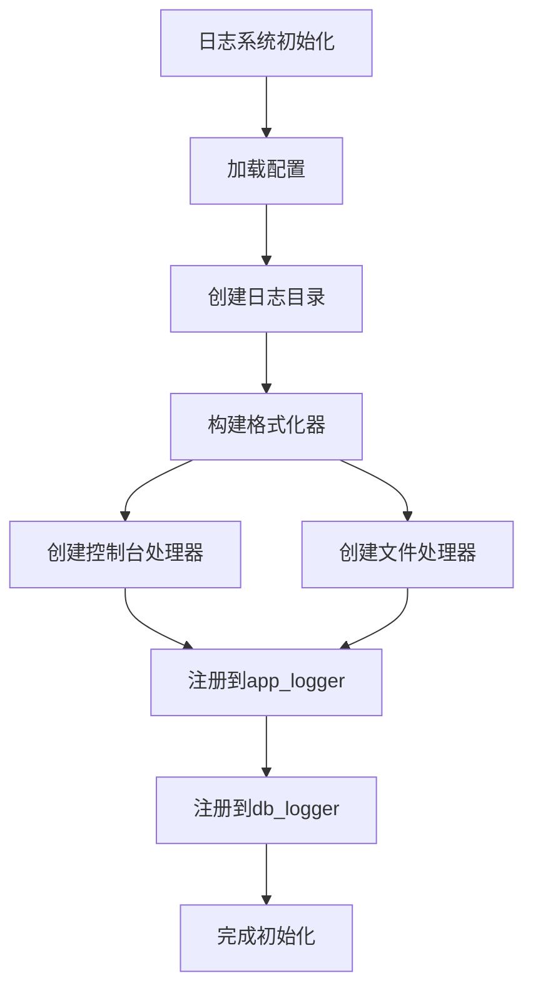
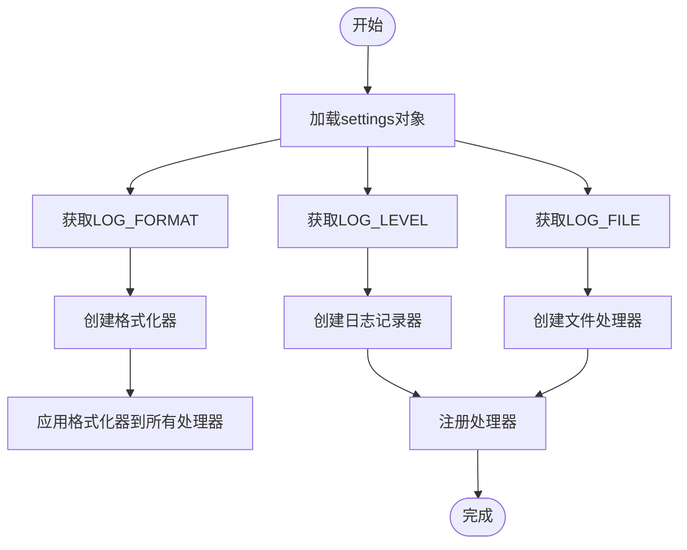
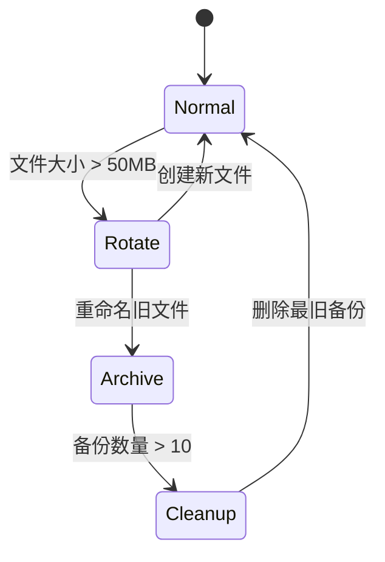
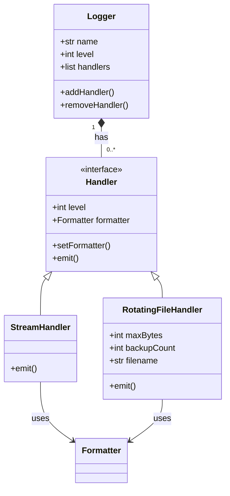

# 日志配置

<cite>
**本文档引用的文件**  
- [logger.py](file://app/core/logger.py)
- [config.py](file://app/core/config.py)
- [performance_recommendations.md](file://performance_recommendations.md)
</cite>

## 目录
1. [日志系统概述](#日志系统概述)
2. [日志初始化流程](#日志初始化流程)
3. [配置参数加载机制](#配置参数加载机制)
4. [RotatingFileHandler配置细节](#rotatingfilehandler配置细节)
5. [双输出处理器机制](#双输出处理器机制)
6. [日志记录器分配策略](#日志记录器分配策略)
7. [性能与安全优化建议](#性能与安全优化建议)

## 日志系统概述
本系统采用Python标准库`logging`模块构建多层级日志体系，支持控制台与文件双重输出，通过配置驱动实现灵活的日志级别、格式和存储策略。系统初始化时自动创建日志目录，并为应用主逻辑和数据库操作分别配置独立的日志记录器。

**Diagram sources**  
- [logger.py](file://app/core/logger.py#L1-L44)

**Section sources**  
- [logger.py](file://app/core/logger.py#L1-L44)

## 日志初始化流程
日志系统的初始化流程始于`app/core/logger.py`文件的模块级代码执行。系统首先确保日志目录存在，随后创建主日志记录器`app_logger`，并基于全局配置构建格式化器和处理器。整个过程在应用启动时自动完成，无需显式调用初始化函数。

初始化顺序如下：
1. 创建`logs`目录（若不存在）
2. 获取`app`命名空间的日志记录器
3. 设置日志级别
4. 构建基于配置的格式化器
5. 创建控制台和文件处理器
6. 将处理器注册到记录器
7. 配置第三方模块日志级别
8. 创建数据库专用记录器

**Section sources**  
- [logger.py](file://app/core/logger.py#L6-L44)

## 配置参数加载机制
日志系统通过`settings`对象从配置文件中加载关键参数，实现配置与代码分离。所有日志相关配置均定义在`app/core/config.py`中的`Settings`类里，通过环境变量可覆盖默认值。

| 配置项 | 默认值 | 说明 |
|--------|-------|------|
| LOG_LEVEL | "DEBUG" | 日志级别（DEBUG/INFO/WARNING/ERROR/CRITICAL） |
| LOG_FORMAT | "%(asctime)s - %(name)s - %(levelname)s - %(message)s" | 日志输出格式 |
| LOG_FILE | "logs/app.log" | 日志文件路径 |

配置加载过程：

**Diagram sources**  
- [config.py](file://app/core/config.py#L57-L59)
- [logger.py](file://app/core/logger.py#L12-L15)

**Section sources**  
- [config.py](file://app/core/config.py#L57-L59)
- [logger.py](file://app/core/logger.py#L12-L15)

## RotatingFileHandler配置细节
文件处理器采用`RotatingFileHandler`实现日志轮转，避免单个日志文件无限增长。具体配置如下：

- **maxBytes**: 50 * 1024 * 1024（50MB）
- **backupCount**: 10
- **encoding**: utf-8
- **filename**: 从`settings.LOG_FILE`读取

当当前日志文件大小超过50MB时，系统自动将其重命名为`app.log.1`，并创建新的`app.log`文件。最多保留10个历史日志文件（app.log.1至app.log.10），超出数量的最旧文件将被删除。

此配置已在`performance_recommendations.md`中确认为优化后的值（原为10MB→50MB，5个备份→10个备份），有效平衡了磁盘空间使用和历史日志保留需求。

**Diagram sources**  
- [logger.py](file://app/core/logger.py#L22-L27)
- [performance_recommendations.md](file://performance_recommendations.md#L28-L30)

**Section sources**  
- [logger.py](file://app/core/logger.py#L22-L27)

## 双输出处理器机制
系统采用双重输出机制，同时将日志输出到控制台和文件，满足不同场景下的监控需求：

- **控制台处理器**：使用`StreamHandler`输出到`sys.stdout`，便于开发调试和容器化部署时的日志收集
- **文件处理器**：使用`RotatingFileHandler`输出到指定文件，用于长期存储和事后分析

两个处理器共享相同的日志级别和格式化器，确保输出一致性。每个处理器独立工作，互不影响，即使文件写入失败，控制台输出仍可正常进行。

**Diagram sources**  
- [logger.py](file://app/core/logger.py#L18-L33)

**Section sources**  
- [logger.py](file://app/core/logger.py#L18-L33)

## 日志记录器分配策略
系统为不同组件分配专门的日志记录器，实现精细化日志管理：

- **app_logger**: 主应用程序记录器，命名空间为`app`
- **db_logger**: 数据库操作记录器，复用`sqlalchemy.engine`的记录器

`db_logger`直接获取`sqlalchemy.engine`的记录器实例，而非创建新命名空间，确保能捕获所有SQLAlchemy产生的日志。两个记录器均注册了相同的控制台和文件处理器，保证日志输出的一致性。

此外，系统还显式设置了`uvicorn`和`sqlalchemy.engine`的日志级别为`INFO`，避免调试信息过多影响日志可读性，体现了生产环境的安全性考虑。

**Section sources**  
- [logger.py](file://app/core/logger.py#L37-L44)

## 性能与安全优化建议
结合`performance_recommendations.md`中的优化建议，日志系统已实施多项性能和安全改进：

### 已完成的优化
- **日志轮转优化**：将文件大小限制从10MB提升至50MB，减少频繁轮转带来的I/O开销
- **备份策略增强**：备份文件数量从5个增加到10个，提供更长的历史追溯周期
- **日志级别调优**：对第三方组件（uvicorn、sqlalchemy）设置合理的日志级别，避免过度输出

### 建议的进一步优化
- **敏感信息过滤**：在日志输出前过滤敏感数据（如API密钥、用户信息）
- **异步日志写入**：考虑使用队列和后台线程进行异步日志写入，避免阻塞主线程
- **日志监控**：集成Prometheus等监控系统，对日志中的错误和警告进行实时告警
- **结构化日志**：考虑采用JSON格式输出结构化日志，便于ELK等日志系统解析

这些优化建议有助于在保证系统可观测性的同时，提升性能和安全性。

**Section sources**  
- [performance_recommendations.md](file://performance_recommendations.md#L25-L30)
- [logger.py](file://app/core/logger.py#L37-L38)